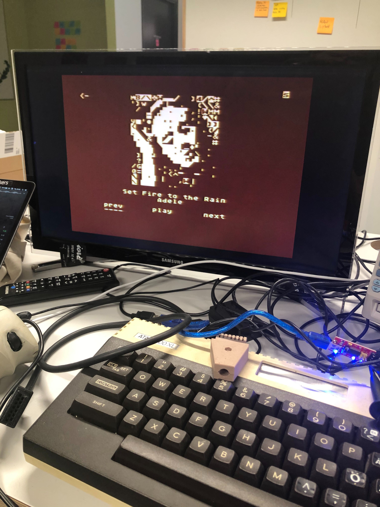
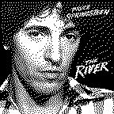
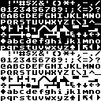
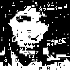

# Running Spotify on an 8-bit Atari

> ⚠️ **Disclaimer:** This code is very hacky, and provided as is. It was rushed in order to make something run in a short amount of time for a demo. Running it yourself might be tricky. It also violates a few rules around what you're allowed to do to the album artworks, and most definitely some branding guidelines too... 😊

Too see it in action, here's a [Tweet with a short live demo video](https://twitter.com/possan/status/1225530633621032961).

## So, How does it work?

When the Atari is first switched on, it will request floppy disk drive information from it's connected peripherals, in this case, the PC is simulating a peripheral and responds saying it's a disk drive, the Atari continues to request some sectors from the disk, the PC will respond with a few sectors containing our custom program, after the last sectors has been transferred, the Atari starts our program.

The program is somewhat similar to a terminal client, it reads the keyboard and joystick input and sends those over the peripheral port to the PC, the PC tells it what to render on the screen, just like in the good old modem dialup days. (Other terminal clients for the 8bit Atari includes Bobterm and Ice-T, neither of which i got to work on this 600XL without a memory expansion)

While the program is running, it might look (or sound) like the Atari generates the audio, which was the whole point, but the audio only passes through the Atari from the device connected on the [peripheral/SIO port](https://atariage.com/forums/topic/230261-making-a-tape-cable-for-the-atari-800xl/?tab=comments#comment-3082045), a port that also happens to have an audio in pin which we can use to connect an audio source to it. The audio then goes through the Atari and out to the RF modulator out to the analog TV.

The Atari is no where close to being able to generate PCM data on it's own, and especially not to decrypt nor decode an OGG stream of audio.

Hardware wise, the only thing needed to connect the Atari to the PC is a usb serial converter like [one of these](https://www.adafruit.com/product/284) and a few cables. (Google SIO2PC, SIO2USB, SIO2BT for plenty of examples)

The end goal was to make a small dongle that you just plug into the back of the Atari, much like a Google Chromecast for your TV.

## The Atari code

The code running on the Atari is a fairly simple [C program](receiver/test.c) and a [small piece of assembler](receiver/intr.s) that is compiled using the excellent [CC65 toolchain](https://www.cc65.org/).

The assembler part was only needed to handle the display list (DLI) rendering interrupt and for calling out to the SIO vector, i'm sure there's a better way to do that though.

When the program starts up, it initializes the display and then sends a "Hello" command over the serial bus to the PC, then it starts to read packets from the serial bus waiting for something to draw to the screen.

All text received over the serial protocol will be printed on the screen, it also supports a few `ESCAPE` sequences with some additional functionality, `C` for clearing the entire screen, `G` to move the cursor to a specific location, and `P` to change the colors on the screen.

After building and linking the code, you'll get an Atari executable (XEX file) - that is then converted into an disk image (ATR file) in order for it to be sent at boot to the Atari, the disk image is generated with a tool named [mkatr](https://github.com/dmsc/mkatr).

It took me a long time to get the serial stuff working, and i initially tried to do raw serial using the serial registers, but kept failing, i randomly discovered the SIOV vector and found some code somewhere that used it and it worked.

There's lots of comments with URLs in them in the code, URLs that points to random places on the internet with some pieces of information that was helpful to get this working.

## The host code

The python code consists of a few files, [main.py](server/main.py) which ties everything together, [spot.py](server/spot.py) which talks to the Spotify API's, [sio.py](server/sio.py) which simulates a SIO diskette station and serial device peripheral, and [image.py](server/image.py) which converts images to atascii.

The code is written in a very synchronous way, with lots of deadlocks. It also has a lot of hardcoded values such as serial port names, client id's, endpoint URLs etc, if you want clean code, you're looking at the wrong repo.

The inner workings and timing magic (one delay somewhere i think) of the SIO parts was stolen partly from [RespeQt](https://github.com/jzatarski/RespeQt) based on [AspeQt](http://aspeqt.sourceforge.net/), and [sio2bsd](https://github.com/TheMontezuma/SIO2BSD).

## The ATASCII album art

So, the way we generate ascii/atascii art from the album covers is fairly straight forward and brute force, it downloads the album art from the CDN, converts it to grayscale, and scales it down to the size used in the Atari, 18x18 characters of each 8x8 pixels, so 144x144 pixels in total.

A few filters are applied to the image, it's first converted to grayscale, then the levels are normalized (to make it higher contrast), lastly it's dithered into two colors.

After that, each 8x8 pixel 'cell', is matched against the characters in the [ATASCII table](server/atascii_actual.png).

It ranks each cell against every character and picks one of top ranked ones for each cell, the result is sometimes quite good.

The background+border color on the Atari is matched to the most dominant color in the cover art.

## Acknowledgements

The Spotify and Atari names and logotypes is a registered trademarks of their respective companies, and this hack was not endorsed or initiated by either.

## License

I suppose a [MIT License](LICENSE.txt) might be ok.
